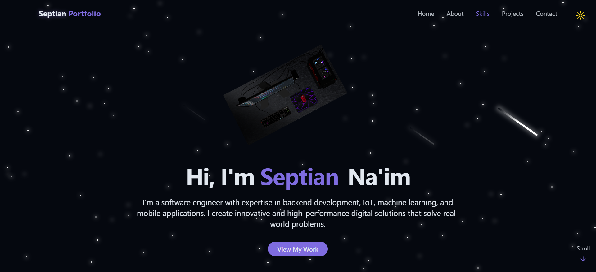

# Portfolio Website - Septian Naim

<div align="center">
  
  <br />
  <div>
    
    
    
    
  </div>
  <h3 align="center">Personal portfolio website built with React and TailwindCSS</h3>
  <br />
</div>

## 📋 Table of Contents

1. [Introduction](#introduction)
2. [Tech Stack](#tech-stack)
3. [Features](#features)
4. [Quick Start](#quick-start)
5. [CV Download](#cv-download)
6. [Deployment](#deployment)

---

## Introduction

This is my personal portfolio website built with React, TailwindCSS, and Vite. It showcases my skills, projects, and experience as a developer. You can also download my latest CV directly from the About section.

---

## Tech Stack

- **React** – Component-based UI development
- **Vite** – Fast build tool
- **TailwindCSS** – Utility-first CSS
- **Lucide Icons** – Icon pack

---

## Features

- Light/Dark mode toggle
- Animated backgrounds
- Responsive navigation
- Hero, About, Skills, Projects, and Contact sections
- Downloadable CV (PDF) from the About section
- Toast notifications

---

## Quick Start

### Prerequisites
- [Node.js](https://nodejs.org/)
- [Git](https://git-scm.com/)

### Clone and Run

```bash
git clone https://github.com/yourusername/your-portfolio-repo.git
cd your-portfolio-repo
npm install
npm run dev
```

Your app will be available at: [http://localhost:5173](http://localhost:5173)

---

## CV Download

You can download my latest CV by clicking the "Download CV" button in the About section of the website. The file is located at `public/CV-TERBARU.pdf`.

---

## Deployment

You can deploy this website easily using Vercel, Netlify, or your preferred static hosting provider.

1. Push your code to GitHub
2. Import your repository to [vercel.com](https://vercel.com) or [netlify.com](https://netlify.com)
3. Click **Deploy**

---

## Credits

- [React](https://reactjs.org/)
- [Tailwind CSS](https://tailwindcss.com/)
- [Lucide Icons](https://lucide.dev/)
- [Vite](https://vitejs.dev/)

---

> Built and maintained by Septian Naim
